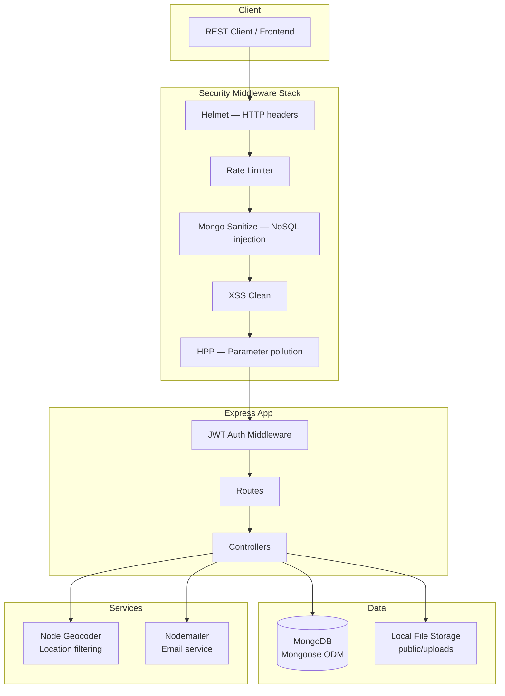

# JobTick — Job Board REST API

Backend REST API for a job board platform. Built while learning Node.js backend development — covers authentication, authorization, geolocation, file uploads, email, and security hardening.

**API Docs:** [Postman Documentation](https://documenter.getpostman.com/view/19567209/2s83YTpSZW)

---

## What it does

- Job listing CRUD — create, read, update, delete with slug-based URLs
- User auth — register, login, JWT + cookie-based sessions
- Role-based access — employers post jobs, candidates apply
- Geolocation — filter jobs by location radius via geocoding API
- File uploads — resumes and company assets
- Email notifications via Nodemailer
- Full test suite with Jest

---

## Architecture



---

## Security Middleware

One notable aspect of this project — proper security stack applied even at learning stage:

| Middleware | Protection |
|-----------|-----------|
| `helmet` | Sets secure HTTP response headers |
| `express-rate-limit` | Brute force and DDoS protection |
| `express-mongo-sanitize` | NoSQL injection prevention |
| `xss-clean` | Cross-site scripting input sanitization |
| `hpp` | HTTP parameter pollution protection |
| `bcryptjs` | Password hashing |
| `validator` | Input validation |

---

## Tech Stack

| Layer | Technology |
|-------|-----------|
| Runtime | Node.js + JavaScript |
| Framework | Express 4 |
| Database | MongoDB + Mongoose |
| Auth | JWT + cookie-parser |
| File Uploads | express-fileupload |
| Geolocation | node-geocoder |
| Email | Nodemailer |
| Testing | Jest |

---

## Project Structure

```
controllers/    — Route handlers (jobs, auth, users)
models/         — Mongoose schemas
routes/         — Express route definitions
middlewares/    — Auth, error handling, async wrapper
utils/          — Geocoder, email, error class
config/         — DB connection, environment config
__tests__/      — Jest test suite
```

---

## Local Setup

```bash
git clone https://github.com/Mohak-Tripathi/JobTick
cd JobTick

npm install

# Create config/config.env and set:
# NODE_ENV, PORT, MONGO_URI, JWT_SECRET, JWT_EXPIRE
# SMTP credentials, GEOCODER_PROVIDER, GEOCODER_API_KEY

npm run dev
```

---

## Note

Built as a learning project to understand Node.js backend fundamentals — REST API design, authentication patterns, security hardening, and MVC structure. Not a production deployment.

---

Built by [Mohak Tripathi](https://linkedin.com/in/mohak-tripathi)
